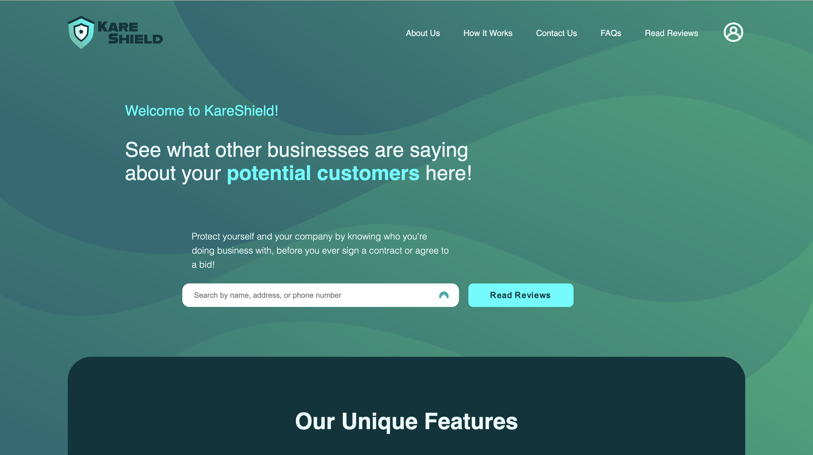
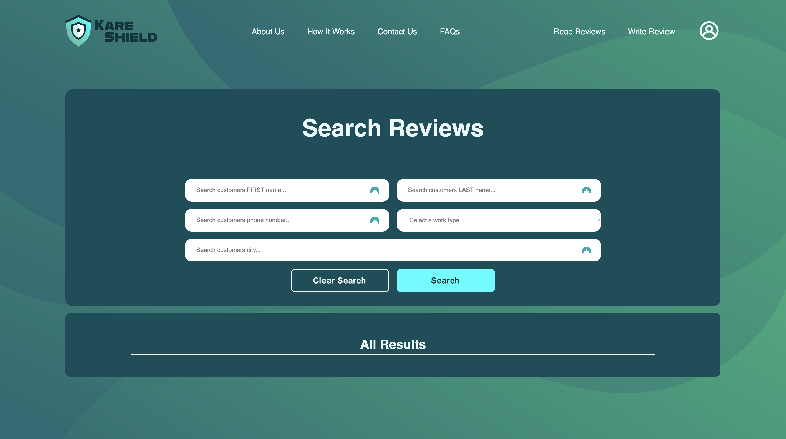
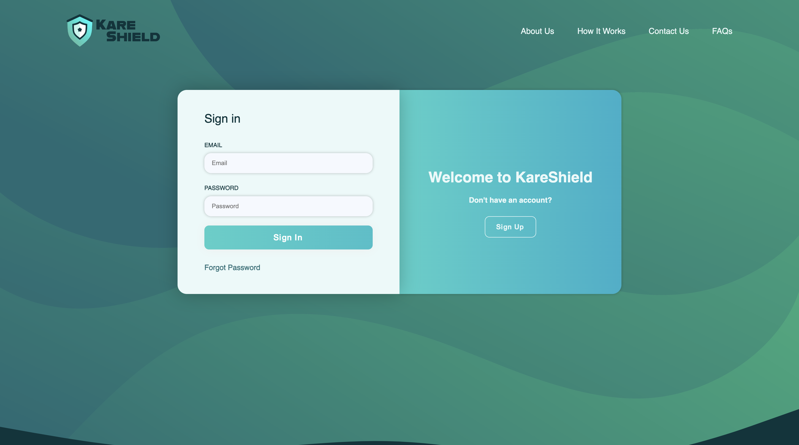

# KareShield - A Client Review System for  Businesses

## For Utah Tech Senior Project Spring of 2024

## Index

1. [Overview](#overview)
2. [Features](#features)
3. [Documentation](#documentation)
4. [Prerequisites](#prerequisites)
5. [Contact](#contact)
6. [Acknowledgements](#acknowledgements)

## Overview

This web application provides a platform for businesses in the construction industry, including landscaping, pool installation, and concrete services, to manage client interactions more effectively. It addresses common challenges such as unpredictable client behavior, delayed payments, and un-communicated project scope changes. The application allows businesses to review clients and access reviews by others, promoting transparency and informed decision-making.

## Features

- **User Account Management**: Secure registration, login, and profile management for business owners.
- **Client Review System**: Businesses can post, search, and view reviews based on client name, phone number, address, or zip code.
<!-- - **Review Moderation and Integrity**: Tools to flag, review, and manage potentially fraudulent or biased reviews. -->
- **User Interface and Experience**: <!-- Mobile-first design, -->Intuitive navigation, and accessible user interfaces designed for non-technical users.
- **Review Rating and Categorization**: Businesses can rate clients on various criteria such as payment timeliness and communication.
<!-- - **Data Visualization and Reporting**: Dashboard for viewing trends and generating reports on client interactions. -->

## Documentation

### End User

- [End User Documentation](./docs/endUser/EndUserDoc.md)

### Technical

- [API/Server Documentation](./docs/serverDoc.md)
- [Vue App (App.js)](./docs/app.jsDoc.md)
- [Database Configuration](./docs/dbDoc.md)
  - [Customer Model](./docs/customerModelDoc.md)
  - [Business Model](./docs/businessModelDoc.md)
  - [Review Model](./docs/reviewModelDoc.md)
  - [User Model](./docs/userModelDoc.md)

## Prerequisites

- Node.js
- MongoDB
- Vue.js

## Contact

Carter Schofield - [Email Me](mailto:carter.schofield17@gmail.com)

Project Link: [KareShield GitHub Repo](https://github.com/CarterSchofield/senior-project)

## Acknowledgements

- [Vue.js](https://vuejs.org/)
- [MongoDB](https://www.mongodb.com/)
- [Node.js](https://nodejs.org/en)
- [Express.js](https://expressjs.com/)
- [Mongoose](https://mongoosejs.com/)
- [Medium](https://medium.com/)

## Images

### Home Page

### Dashboard

### Sign in Page

